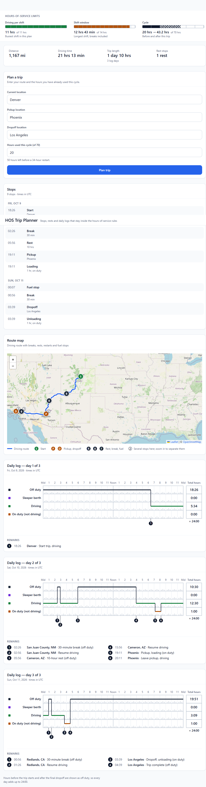

# HOS Trip Planner

**Plan a truck trip from where you are to the pickup and the dropoff, and get the stops, rests and daily log sheets that keep it inside the US hours-of-service rules.**

A full-stack **Hours of Service (HOS)** trip planner for commercial drivers. Enter the current location, pickup, dropoff and cycle hours already used; the backend routes the trip with **OpenRouteService**, simulates driving against the HOS limits, and returns **stops** and **daily log** segments. The **React** frontend draws the route on a map and one ELD-style log sheet per day.

| Environment | URL |
|-------------|-----|
| **Live app** | [spotter-hos-app.vercel.app](https://spotter-hos-app.vercel.app) |
| **API (production)** | [spotter-hos-app-e2aab.containers.snapdeploy.app](https://spotter-hos-app-e2aab.containers.snapdeploy.app) |
| **Source** | [github.com/SyedHaider037/spotter-hos-app](https://github.com/SyedHaider037/spotter-hos-app) |

> The production API runs on a free tier that sleeps after about 15 minutes idle. The first visit after a quiet period can take up to about a minute while it wakes up; the app shows a notice and retries on its own. See [Cold starts and retries](#cold-starts-and-retries).

---

## Screenshots



---

## Features

- **Trip form**: current location, pickup, dropoff, and cycle hours used (checked as you type, 0 to 70).
- **Hours-of-service limits strip**: driving per shift, shift window and cycle, as ruled bars; after a plan it shows the busiest shift and the cycle before and after the trip.
- **Trip summary**: distance, driving time, trip length, rest stops.
- **Route map** (React + Leaflet): the road geometry from OpenRouteService in blue, lettered stop markers coloured by duty status (with a count where several stops share a spot), popups, and a legend.
- **Stops list**: breaks, rests, restarts, fuel, pickup and dropoff, grouped by day, with times and durations (UTC).
- **Daily log sheets** (SVG): one logbook-style sheet per day with the four duty-status rows (off duty, sleeper berth, driving, on duty not driving), a line through each status change, numbered remarks (place and activity), and per-row hour totals that add up to 24:00 for each day.
- **34-hour restart**: inserted when the 70-hour cycle is reached mid-trip (or at the start, if the cycle is already full).
- **Rate limiting**, a friendly message when the limit is hit, and cold-start handling for the free hosting tier.
- **JSON API**: a single planning endpoint for the SPA and for integrations.

---

## How it works

1. **Geocoding and routing.** The backend geocodes the three location strings and requests directions for two legs (current to pickup, pickup to dropoff) from OpenRouteService on `api.heigit.org`: Pelias for geocoding and reverse geocoding, and the **`driving-hgv`** profile for the road geometry and distance. Rest and break positions are reverse geocoded to "City, ST" labels for the log remarks.
2. **Driving time is an assumption, not ORS data.** Each leg's driving time is its distance divided by `TRUCK_AVG_MPH` (default **55 mph**). The duration ORS returns is not used. The reason: on a test trip (Denver to Phoenix to Los Angeles) the `driving-hgv` durations averaged about 40 mph, which would make every plan far too long. 55 mph is a planning assumption you can change, not a measured or "truck-accurate" speed.
3. **HOS simulation.** The planner moves a clock along the route and inserts breaks, rests, fuel markers, pickup, dropoff and restarts as the rules require (see [HOS rules](#hos-rules-implemented)).
4. **Fuel stops.** A fuel stop is a **zero-minute marker every 1,000 miles driven**. Each driving chunk is cut at the 1,000-mile point, so the marker lands exactly there, even in the middle of a leg. If the mark falls exactly at the end of the first leg the marker is placed at the pickup; none is added at the final dropoff.
5. **Stop positions** are placed by fraction of the leg driven, interpolated between the route's polyline points. That is an approximation, not a distance-accurate position.

---

## Tech stack

| Layer | Technology |
|-------|------------|
| **Backend** | Python 3, **Django 6**, **Django REST Framework**, Gunicorn, Docker |
| **Frontend** | **React** 19, Create React App, **react-leaflet** / Leaflet |
| **Routing / maps** | [OpenRouteService](https://openrouteservice.org/) via `api.heigit.org` (Pelias geocoding, `driving-hgv` directions) |
| **Config** | Environment variables (`python-dotenv` loads `backend/.env` locally) |
| **CORS** | `django-cors-headers` with an explicit, environment-driven origin allowlist; `Retry-After` is exposed to the browser |
| **CI** | GitHub Actions: backend and frontend tests and builds on every push |

---

## Repository layout

```
spotter-hos-app/
├── .github/workflows/ci.yml   # CI: tests, Django check and frontend build
├── backend/
│   ├── backend/               # Django project (settings, urls, wsgi)
│   ├── trip/                  # the app: views, throttling, error handling
│   │   ├── services/          # hos_rules.py, trip_planner.py, route_service.py
│   │   └── tests/             # backend tests
│   ├── Dockerfile
│   ├── manage.py
│   └── requirements.txt
├── frontend/
│   ├── public/
│   └── src/
│       ├── components/        # map, summary, limits strip, log sheet, preview
│       └── utils/             # pure functions with their Jest tests
├── docs/                      # PRD, architecture notes, task breakdown (status-marked)
├── LICENSE                    # MIT
└── README.md
```

The working folder may also contain `_bmad/`, `bmad-output/` and `.agents/`. They are local tooling for planning and AI assistance, are listed in `.gitignore`, and are not part of the repository or of the app.

---

## Run locally

### Prerequisites

- Python **3.12+** (Django 6 requires it; CI and the Docker image use 3.13)
- Node.js and npm (CI runs Node 22)
- An **OpenRouteService** API key ([openrouteservice.org](https://openrouteservice.org/))

### 1. Backend

```bash
cd backend
python -m venv venv
# Windows: venv\Scripts\activate
# macOS/Linux: source venv/bin/activate
pip install -r requirements.txt
cp .env.example .env
```

Edit `backend/.env` with real values. The app **refuses to start without `DJANGO_SECRET_KEY`**. Generate one with:

```bash
python -c "import secrets; print(secrets.token_urlsafe(50))"
```

For local development also set `DJANGO_DEBUG=True` (it defaults to `False`). See [Environment variables](#environment-variables) for the full list.

```bash
python manage.py migrate   # optional: the app has no models; this just silences the unapplied-migrations warning
python manage.py runserver
```

API base (local): **http://localhost:8000**

### 2. Frontend

```bash
cd frontend
npm install
cp .env.example .env.local   # points the app at http://localhost:8000
npm start
```

The dev server defaults to **http://localhost:3000**, which is also the default CORS origin the backend allows. Without `.env.local`, the frontend calls the deployed production API.

### 3. Tests

```bash
# Backend: 126 tests. OpenRouteService is mocked, so no API key or network is needed.
cd backend
python manage.py test trip

# Frontend: 62 tests in 5 suites (pure functions only; there are no component or end-to-end tests).
cd frontend
CI=true npm test -- --watchAll=false
```

The counts above were taken when this README was written. CI runs both suites, `python manage.py check` and `npm run build` on every push and pull request.

---

## Environment variables

### Backend (`backend/.env` locally, platform settings in production)

| Variable | Required | Default | Purpose |
|----------|----------|---------|---------|
| `ORS_API_KEY` | Yes | _(empty)_ | OpenRouteService key. Without it every plan request returns a 400 error. |
| `DJANGO_SECRET_KEY` | Yes | _(none)_ | Django secret key. Startup fails if it is missing. |
| `DJANGO_DEBUG` | No | `False` | Set to `True` only for local development. |
| `DJANGO_ALLOWED_HOSTS` | No | `localhost,127.0.0.1` | Comma-separated hostnames. In production, include the deployed API hostname. |
| `CORS_ALLOWED_ORIGINS` | No | `http://localhost:3000` | Comma-separated frontend origins, with scheme and no trailing slash (e.g. `https://spotter-hos-app.vercel.app`). |
| `PLAN_THROTTLE_RATE` | No | `15/hour` | Rate limit for `POST /api/plan/`, per client address (any DRF rate such as `30/hour`). |
| `THROTTLE_NUM_PROXIES` | No | `1` | How many reverse proxies append to `X-Forwarded-For` in front of the app. The client address is that many entries from the right; `0` uses only the socket address. |
| `TRUCK_AVG_MPH` | No | `55` | Average truck speed used to turn route distance into driving time. Must be a number from 30 to 75; anything else falls back to 55 and logs a warning. |
| `DATABASE_URL` | Platform only | – | Set by the hosting platform when a PostgreSQL database is attached, because its deployment scanner requires one. **The app does not read it**: it has no models and stores no data. |

### Frontend

| Variable | Required | Default | Purpose |
|----------|----------|---------|---------|
| `REACT_APP_API_URL` | No | The production SnapDeploy API | Backend base URL, no trailing slash. Baked in at build time. |

---

## API documentation

### `POST /api/plan/`

Plans a trip from **current location → pickup → dropoff**. Routing and distance come from OpenRouteService; driving time is distance at `TRUCK_AVG_MPH`; the HOS simulator builds the stops and logs.

**URL (local)**  
`http://localhost:8000/api/plan/`

**URL (production)**  
`https://spotter-hos-app-e2aab.containers.snapdeploy.app/api/plan/`

**Headers**

| Header | Value |
|--------|--------|
| `Content-Type` | `application/json` |

**Request body (JSON)**

| Field | Type | Required | Description |
|-------|------|----------|-------------|
| `current_location` | string | Yes | Driver’s current location (free text; geocoded by ORS) |
| `pickup_location` | string | Yes | Pickup address or place name |
| `dropoff_location` | string | Yes | Dropoff address or place name |
| `cycle_used_hours` | number | Yes | Hours already used toward the **70-hour** cycle (0 to 70) |

The trip starts at the moment of the request (UTC); there is no start-time field.

**Example**

```bash
curl -s -X POST https://spotter-hos-app-e2aab.containers.snapdeploy.app/api/plan/ \
  -H "Content-Type: application/json" \
  -d '{
    "current_location": "Chicago, IL",
    "pickup_location": "Dallas, TX",
    "dropoff_location": "New York, NY",
    "cycle_used_hours": 20
  }'
```

**Success — `200 OK`** (trimmed; a real response has one entry per stop and per day)

```json
{
  "stops": [
    {
      "type": "CURRENT",
      "location": "Chicago, IL",
      "lat": 41.88,
      "lng": -87.63,
      "start_time": "2026-01-01T12:00:00Z",
      "end_time": "2026-01-01T12:00:00Z",
      "duration": 0
    }
  ],
  "daily_logs": [
    {
      "date": "2026-01-01",
      "segments": [
        {
          "status": "DRIVING",
          "start": "2026-01-01T12:00:00Z",
          "end": "2026-01-01T14:00:00Z"
        }
      ],
      "remarks": [
        {
          "time": "2026-01-01T12:00:00Z",
          "place": "Chicago, IL",
          "activity": "Start trip, driving"
        }
      ]
    }
  ],
  "route": {
    "encoding": "polyline5",
    "legs": [
      { "polyline": "_p~iF~ps|U_ulLnnqC_mqNvxq`@" },
      { "polyline": "..." }
    ]
  }
}
```

`duration` is in minutes. Each daily log's `remarks` list has one entry per duty-status change that day. `place` is the location as typed for the start, pickup and dropoff, and a "City, ST" (or "X County, ST") label from OpenRouteService reverse geocoding for rests and breaks, falling back to coordinates if that lookup fails.

`route.legs` has one entry per leg (current → pickup, then pickup → dropoff). Each `polyline` is the road geometry from OpenRouteService as a [Google encoded polyline](https://developers.google.com/maps/documentation/utilities/polylinealgorithm) (1e-5 degree precision), which the frontend decodes and draws on the map.

Stop `type` values: `CURRENT`, `PICKUP`, `DROPOFF`, `BREAK_30`, `REST_10`, `RESTART_34`, `FUEL`, `ON_DUTY`. Segment `status` values: `OFF_DUTY`, `SLEEPER`, `ON_DUTY`, `DRIVING`.

**Client / validation errors — `400 Bad Request`**

```json
{
  "error": {
    "code": "PLAN_FAILED",
    "message": "Human-readable reason (e.g. invalid field, invalid JSON, ORS error, cycle_used_hours over 70)."
  }
}
```

A request is rejected when `cycle_used_hours` is **greater than 70**. A trip that reaches 70 hours along the way is planned: the response includes a `RESTART_34` stop (34 hours off duty) at the point the cap is hit, and a request with `cycle_used_hours` of exactly 70 begins with the restart.

**Rate limited — `429 Too Many Requests`**

```json
{
  "error": {
    "code": "RATE_LIMITED",
    "message": "Too many trip plans from this address. Try again in 1235 seconds."
  }
}
```

The response carries a `Retry-After` header (seconds), which CORS exposes to the browser. The frontend turns it into "Please try again in about N minutes."

**Server errors — `500 Internal Server Error`**

```json
{
  "error": {
    "code": "INTERNAL_ERROR",
    "message": "Unexpected server error."
  }
}
```

---

## Rate limiting

- `POST /api/plan/` (the only throttled endpoint) allows **15 requests per hour** per client address, set by `PLAN_THROTTLE_RATE`. Each plan spends OpenRouteService free-tier quota.
- **Which address is counted.** The app sits behind the host's proxy and Cloudflare. If the proxy hop that reaches the app (the last entry in `X-Forwarded-For` when `THROTTLE_NUM_PROXIES` is 1) is inside Cloudflare's published address ranges, the visitor's own address is read from the `CF-Connecting-IP` header (it must be a single valid IPv4 or IPv6 address). Otherwise the proxy hop itself is counted and the header is ignored, because anyone could forge it. The Cloudflare ranges are a constant in `backend/backend/settings.py`, copied from cloudflare.com/ips-v4 and /ips-v6 on 2026-10-07; they are not refreshed automatically.
- The throttle counts are kept in the app's memory, so they reset when the container restarts.
- **What is verified.** The behaviour is covered by automated tests with mocked headers. It has **not** been verified against live traffic after the final change.
- Logs: each plan request logs the number of `X-Forwarded-For` entries, the counted address with its last part masked (IPv4: first three parts; IPv6: first three groups) and the source used. Full addresses are never logged.

---

## Cold starts and retries

The free SnapDeploy tier sleeps the container after about 15 minutes idle, and a plain request does not wake it; a real browser page load does. So:

- **Hidden iframe.** On page load the app loads the backend's root page in a hidden iframe, which wakes the container.
- **Retries.** A plan request is attempted up to **7 times**, **10 seconds apart**, with a **30 s** timeout each, for as long as the server has never answered. Once it has answered, a plan gets one attempt with a **65 s** timeout (the backend allows 60 s).
- **Worst case** for a server that never wakes: 7 × 30 s + 6 × 10 s = **270 s**. When the platform answers at once with its error page, the 7 attempts are used up in about a minute; if the server needs longer than that, the form shows an error and you can try again.
- **What you see.** After 15 s a notice says the server is starting up; during retries it shows the attempt number ("attempt N of 7"). If every attempt fails the form shows an error asking you to try again in a moment.
- Only network failures, timeouts and the platform's own error page are retried. An answer from the app itself (including a 429) is shown, not retried.

---

## HOS rules implemented

The planner applies these constraints (see `backend/trip/services/hos_rules.py` and `trip_planner.py`):

| Rule | Value |
|------|--------|
| Maximum driving per shift | **11 hours** |
| On-duty / driving shift window | **14 hours** |
| Minimum rest between shifts | **10 hours** |
| Break after cumulative driving | **30 minutes** after **8 hours** driving |
| Cycle limit | **70 hours** (a flat budget); a **34-hour restart** is inserted when it is reached mid-trip |
| Fuel stop | A **zero-minute marker every 1,000 miles** driven |
| Pickup / dropoff | **1 hour** on duty each |

> **Note:** Regulatory HOS has additional nuances (recap vs reset, personal conveyance, adverse driving, etc.). This project implements the rules listed in the product spec for planning and visualization.

---

## Design system

The frontend uses plain CSS with a small design system in `frontend/src/index.css` and `App.css`:

- **Type scale** of five sizes (12, 14, 16, 20 and 28 px) and three weights; inputs are 16 px so iOS Safari does not zoom.
- **Colour tokens** in two tiers: primitive ramps, and semantic tokens that components use. Duty statuses have their own colours (driving green, on duty amber, off duty slate, sleeper violet); the accent blue is for interactive controls, and the route line is blue.
- **Accessibility**: one visible, linked label per field, ARIA roles for the notices, meters and log sheets, visible keyboard focus, and reduced-motion support.
- **Responsive layout**: a form column beside the results, a slimmer form column below 1240 px, a single column below 980 px; at 600 px and below the paddings tighten, the map is shorter and the limits strip becomes compact rows. The log sheet is drawn to the width of its container.
- **Touch targets**: on screens up to 600 px wide, the map's zoom buttons, stop markers, attribution links and popup close button have 44 × 44 px targets.
- Checked in a browser at 360 and 390 px widths with the page showing no sideways scrolling; not tested on a physical device.

---

## Known limitations

- **Flat 70-hour budget.** The cycle limit is a single running total, not a rolling 8-day window. When a trip reaches 70 hours, the planner inserts a 34-hour off-duty restart (which resets the whole budget) and keeps going. It does not model the 8-day recap. A request with `cycle_used_hours` above 70 is rejected, and one at exactly 70 begins with a restart.
- **Driving speed is an assumption.** Driving time uses a flat `TRUCK_AVG_MPH` (default 55) for the whole route, whatever the roads, weather or vehicle. ORS durations are not used.
- **Approximate stop positions.** Stops are placed by interpolating between route polyline points, not by exact distance.
- **Timing.** Trips start at the moment of the request, and daily logs split at UTC midnight rather than the driver's local day. Times are shown in UTC.
- **Rate limit by address.** The limit is per client address, not per person. Behind Cloudflare the visitor address is used; if the proxy hop is not a Cloudflare address, everyone sharing that hop shares one limit. An IPv6 visitor can rotate addresses inside their own block and so get around the limit. The counts live in memory and reset when the container restarts.
- **Cloudflare ranges are static.** They were copied on 2026-10-07 and must be updated by hand.
- **Cold starts.** On the free hosting tier the first visit after idle can take up to about a minute, and in the worst case a plan attempt can wait up to 270 s.
- **No persistence.** Plans are not saved; reloading the page clears the result.
- **Tests.** There are no component or end-to-end tests, and the UI has been checked in a browser by hand only.

---

## What I would build next

- Cache ORS responses (for repeat routes and to save free-tier quota).
- A rolling 8-day cycle recap instead of the flat 70-hour budget.
- Sleeper-berth splits.
- Saved plans (accounts and a database).
- Distance-accurate stop positions along the route.
- End-to-end and component tests.
- Per-vehicle truck routing with realistic speeds instead of one flat average.
- Automatic refresh of the Cloudflare range list.

---

## Deployment

| Component | Platform | URL |
|-----------|----------|-----|
| **Frontend** | Vercel | [spotter-hos-app.vercel.app](https://spotter-hos-app.vercel.app) |
| **Backend** | SnapDeploy (Docker) | [spotter-hos-app-e2aab.containers.snapdeploy.app](https://spotter-hos-app-e2aab.containers.snapdeploy.app) |

**Backend (SnapDeploy)**

- Built from [`backend/Dockerfile`](backend/Dockerfile) (`python:3.13-slim`). Gunicorn runs with **1 worker, 4 threads and a 60 s timeout**: plans spend their time waiting on OpenRouteService, so threads let two run at once without a second process using the free tier's memory, and the longer timeout lets a slow routing response finish. The container listens on the platform-assigned `$PORT`.
- Set the [environment variables](#environment-variables) above: at minimum `ORS_API_KEY`, `DJANGO_SECRET_KEY`, `DJANGO_ALLOWED_HOSTS` (the SnapDeploy hostname) and `CORS_ALLOWED_ORIGINS` (the Vercel origin).
- `DATABASE_URL` is supplied by the platform's attached PostgreSQL database. The scanner requires one, but the app never connects to it.

**Frontend (Vercel)**

- Build command: `npm run build` (from `frontend/`)
- Output directory: `frontend/build` (or root as configured in the Vercel project)
- `REACT_APP_API_URL` is optional; leave it unset to use the SnapDeploy API.

**CORS**

- Production: add your Vercel origin (e.g. `https://spotter-hos-app.vercel.app`) to `CORS_ALLOWED_ORIGINS`. Vercel preview URLs change per deploy, so add them too if you need to test previews.

---

## License

Released under the [MIT License](LICENSE).

---

## Contributing

Issues and pull requests are welcome at [github.com/SyedHaider037/spotter-hos-app](https://github.com/SyedHaider037/spotter-hos-app).
